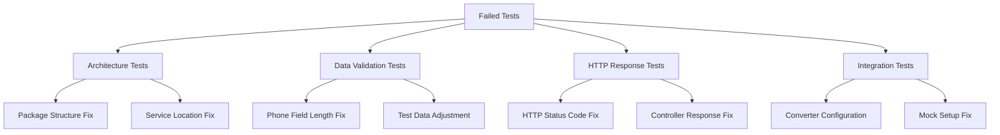

# Design Document

## Overview

Este documento describe el diseño para corregir todos los tests fallidos en el proyecto DataVet. La solución se enfoca en cuatro áreas principales: corrección de estructura de paquetes, ajuste de validaciones de datos, corrección de códigos de respuesta HTTP, y reparación de tests de integración de convertidores compartidos.

## Architecture

### Test Categories and Fix Strategy



### Fix Priority Matrix

1. **High Priority**: Data validation errors (blocking persistence)
2. **Medium Priority**: HTTP response code mismatches
3. **Low Priority**: Architecture test adjustments

## Components and Interfaces

### 1. Architecture Test Fixes

**Component**: `DomainArchitectureIntegrationTest`
- **Issue**: Expecting `application.OwnerService` package but finding `application.service`
- **Solution**: Update test expectations to match actual package structure
- **Interface**: Test assertion methods

**Component**: `ApplicationLayerBoundaryTest`
- **Issue**: Same package naming convention issue
- **Solution**: Align test expectations with current architecture

### 2. Data Validation Fixes

**Component**: `OwnerEntity` phone field
- **Issue**: Phone field limited to 10 characters but tests use 11+ character values
- **Solution**: Either increase database column size or adjust test data

**Component**: `SharedConverterIntegrationTest`
- **Issue**: Phone value objects exceeding database constraints
- **Solution**: Update test data to use valid phone formats

### 3. HTTP Response Code Fixes

**Component**: `ClinicController.delete()` method
- **Issue**: Test expects HTTP 200 but method returns 204
- **Solution**: Update test expectation to match REST standard (204 for successful delete)

**Component**: `ClinicControllerIntegrationTest`
- **Interface**: MockMvc test assertions

### 4. Service Exception Handling

**Component**: `ClinicServiceExceptionTest`
- **Issue**: Mock repository not properly configured for exception scenarios
- **Solution**: Fix mock setup to throw expected exceptions

## Data Models

### Phone Value Object Constraints

```java
// Current constraint issue
@Column(name = "phone", length = 10)  // Database constraint
private String phone;

// Test data causing issues
"+1234567890"  // 11 characters
"+0987654321"  // 11 characters
"+1122334455"  // 11 characters
```

### Solution Options

1. **Option A**: Increase database column size to 15 characters
2. **Option B**: Adjust test data to fit 10-character limit
3. **Option C**: Update Phone value object validation

## Error Handling

### Exception Scenarios

1. **ClinicNotFoundException**: Ensure proper mock configuration
2. **DataIntegrityViolationException**: Handle phone field length violations
3. **ValidationException**: Proper test data validation

### Error Recovery Strategy

- Use transaction rollback for integration tests
- Implement proper cleanup in test teardown methods
- Use @DirtiesContext where necessary for test isolation

## Testing Strategy

### Test Data Management

```java
// Valid test data patterns
public class TestDataFactory {
    public static String validPhone() {
        return "+123456789";  // 10 characters max
    }
    
    public static Address validAddress() {
        return new Address("Street", "City", "12345");
    }
}
```

### Mock Configuration

```java
// Proper mock setup for exception tests
@Mock
private ClinicRepository clinicRepository;

@Test
void deleteClinic_ShouldThrowException() {
    when(clinicRepository.findById(1L))
        .thenThrow(new ClinicNotFoundException("Clinic not found with id: 1"));
}
```

### Integration Test Patterns

- Use @Transactional for automatic rollback
- Configure proper test profiles
- Use embedded database for isolation

## Implementation Approach

### Phase 1: Data Validation Fixes (Critical)
- Fix phone field length constraints
- Update test data to valid formats
- Ensure converter compatibility

### Phase 2: HTTP Response Fixes (Medium)
- Update test expectations for DELETE operations
- Align with REST standards (204 for successful delete)

### Phase 3: Architecture Test Updates (Low)
- Update package name expectations
- Align with current project structure

### Phase 4: Exception Handling (Medium)
- Fix mock configurations
- Ensure proper exception propagation

## Configuration Changes

### Database Schema Updates (if needed)
```sql
-- Option to increase phone field size
ALTER TABLE owner MODIFY COLUMN phone VARCHAR(15);
ALTER TABLE clinic MODIFY COLUMN phone VARCHAR(15);
```

### Test Configuration
```properties
# Test-specific properties
spring.jpa.hibernate.ddl-auto=create-drop
spring.datasource.url=jdbc:h2:mem:testdb
logging.level.org.hibernate.SQL=DEBUG
```